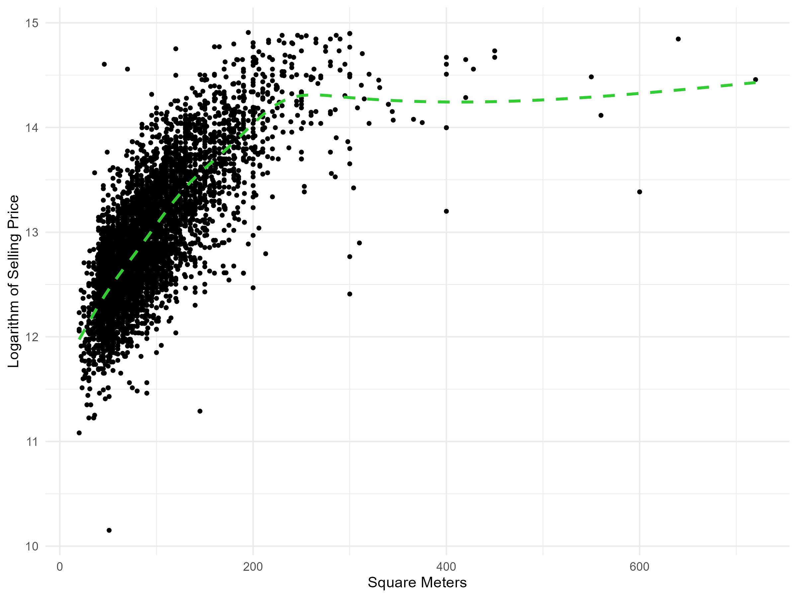
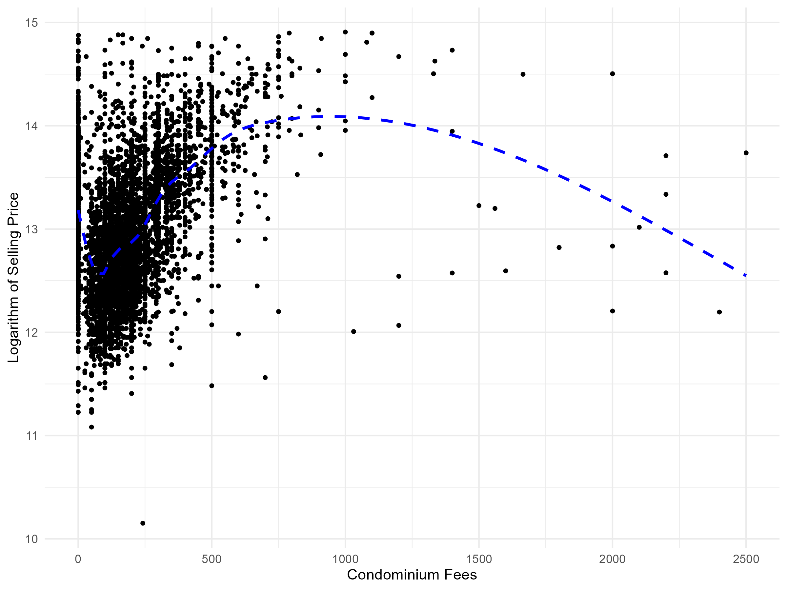
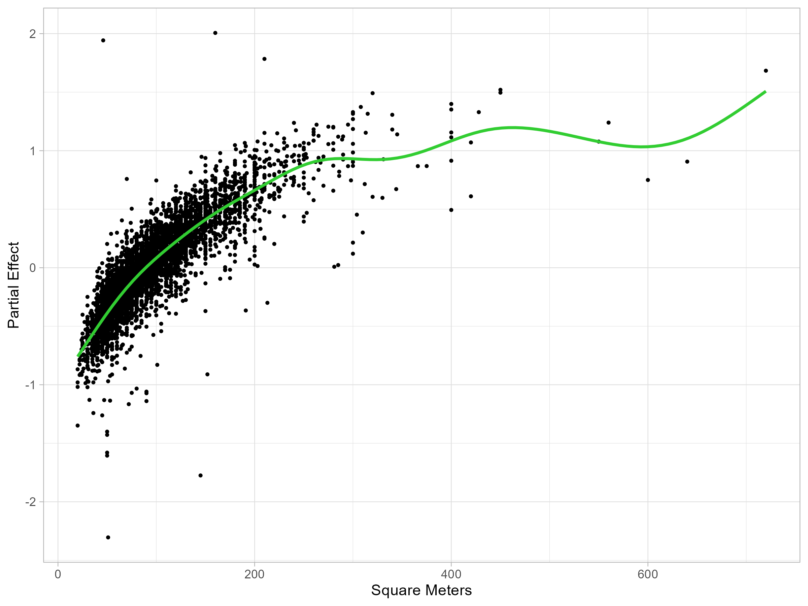
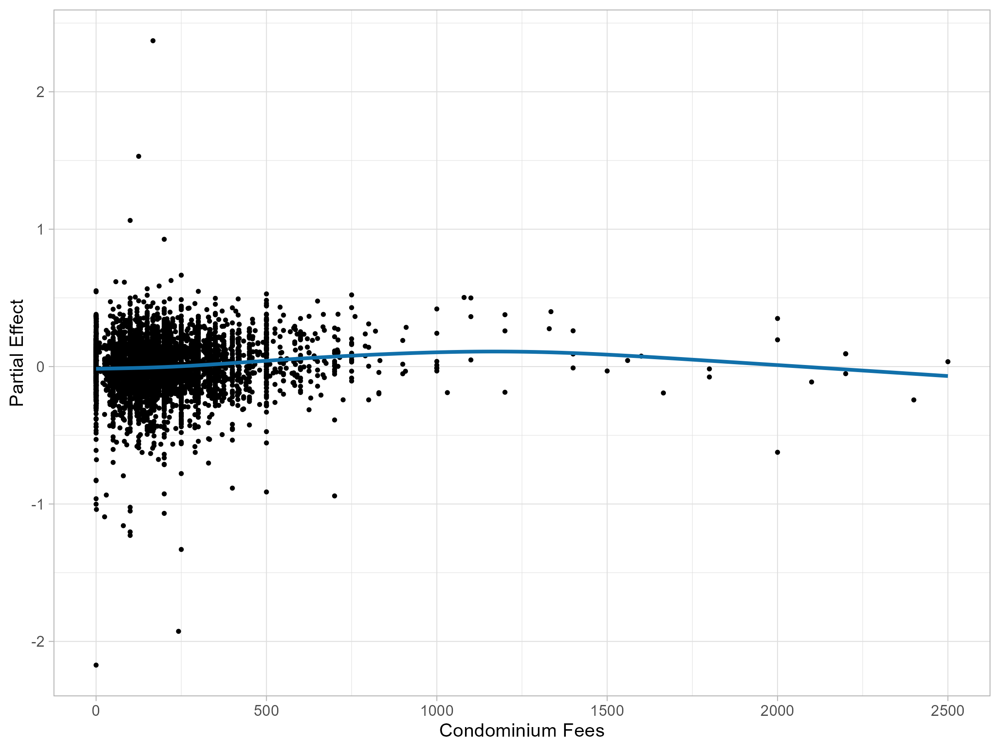
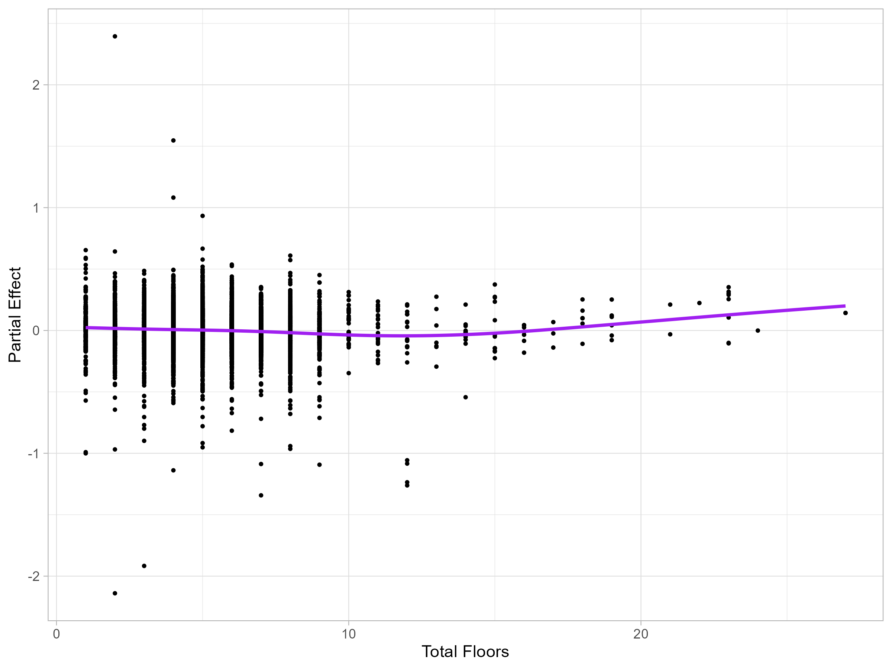

# Modeling and Results

This document describes the modeling phase of the Milan housing price project.
The analysis closely follows the *Modeling and Results* section of the original report
and mirrors the implementation in the R modeling script.

> **Prerequisite**  
> All analyses presented here assume that the data have already been cleaned,
> feature-engineered, and imputed as described in  
> [`preprocessing.md`](./preprocessing.md).
> The input dataset for this phase is `cleaned_training.csv`.

---

##  Setup and Data Loading

We begin by clearing the workspace, loading the required libraries, and reading the
cleaned dataset produced during the pre-processing phase.

```r
rm(list = ls())

library(ggplot2)
library(dplyr)
library(MASS)

data <- read.csv("cleaned_training.csv", header = TRUE)
```

To evaluate predictive performance, the dataset is randomly split into a training set and a validation set. 

```r
set.seed(123)

id_train <- sort(sample(1:nrow(data), size = floor(0.66 * nrow(data)), replace = FALSE))
id_validation <- setdiff(1:nrow(data), id_train)

# Train e Validation Split
train <- data[id_train, ]
validation <- data[id_validation, ]
```

## Setting a Benchmark

Model performance is evaluated using the **Mean Absolute Error (MAE)**, which is the quantity we aim to **minimize** throughout the project. The **MAE** represents the **average absolute error** made when predicting the market value of a house. In practical terms, it quantifies how many euros, on average, the predicted selling price differs from the true observed price, making it a directly interpretable objective for model comparison.

As a reference point, we compute the **MAE** obtained by a naive predictor that assigns the training median price to every observation in the validation set. This is a
strong and simple **benchmark**: it is hard to do worse than predicting a constant value for all houses. Therefore, any future model should improve upon this **MAE**; performing
worse would indicate that the model is failing to extract useful information from the covariates, which would be a serious issue in a supervised prediction setting.

```r
MAE <- function(y, y_fit) {
  mean(abs(y - y_fit))
}

y_hat_median <- rep(median(train$selling_price), nrow(validation)) 
round(MAE(validation$selling_price, y_hat_median), 4)
```

## Simple Linear Model on Log-Prices

The first model considered is a **simple linear regression**. A linear model on the original price scale does not impose any constraint that guarantees positive
predictions, and predicting negative house prices would clearly be meaningless.

For this reason, in contexts where the response variable is strictly positive, it is common practice to model the **logarithm of the selling price**. Predictions can then be mapped back to the original scale using the exponential function, which guarantees positivity, **at the cost of introducing distortion**, since the back-transformation does not preserve expectations due to the nonlinearity of the exponential function.

The model specification can be written in plain form as:

- response variable: `log(selling_price)`
- predictors:
  - `square_meters`
  - `zona_new`
  - `condominium_fees`
  - `conditions`

These covariates are selected without a formal selection procedure, but based on domain knowledge and common sense. We obtain a **MAE** of 162156.9.

```r
m_simple <- lm(log(selling_price) ~ square_meters + zona_new + condominium_fees +  conditions, data = train)

y_hat_simple <- exp(predict(m_simple, newdata = validation))

round(MAE(validation$selling_price, y_hat_simple), 4)
```

## Generalized Additive Model (GAM)

Every statistical model is an approximation of reality, but in this case the limitations of the linear specification are not negligible. Exploratory plots
show that the relationship between the logarithm of the selling price and `square_meters` as well as `condominium_fees` is clearly nonlinear. A nonparametric
approach for modeling these covariates therefore represents a natural alternative.

<div align="center">



<br>

**Figure 1: Scatterplots of (a) square.meters, (b) condominium.fees**

</div>


For this reason, a **Generalized Additive Model (GAM)** is adopted. GAMs allow the
simultaneous inclusion of smooth (nonparametric) functions and linear terms within
the same model. In the present case, the variables `square_meters`,
`condominium_fees`, and `total_floors` are modeled nonparametrically using **low-rank
thin plate regression splines**, while all remaining predictors enter the model as
linear terms.

Smoothing parameters are selected using **REML**, an alternative to GCV that can be
interpreted as its asymptotic variant and is often more stable in practice.

The model specification can be described in plain terms as:
- response variable: `log(selling_price)`
- smooth terms: `square_meters`, `condominium_fees`, `total_floors`
- linear terms: all remaining covariates

```r
library(mgcv)

# Variables modeled with splines
spline_vars <- c("square_meters", "condominium_fees", "total_floors")

# All predictors except the response
all_vars <- setdiff(names(train), "selling_price")

# Linear predictors
linear_vars <- setdiff(all_vars, spline_vars)

# Spline terms (thin plate regression splines)
spline_terms <- paste0("s(", spline_vars, ", bs = 'tp')")

# Final model formula
formula_string <- paste("log(selling_price) ~", paste(c(spline_terms, linear_vars), collapse = " + "))
formula_finale <- as.formula(formula_string)

# Fit GAM
m_gam <- gam(formula_finale, data = train, method = "REML")
```
The table below reports the effective degrees of freedom (EDF) associated with the smooth components of the GAM.
For all three covariates, the EDF values are clearly larger than 1, indicating that the corresponding smooth functions do not collapse to linear terms. Had the EDF been equal (or very close) to 1, the smooth effect would have effectively reduced to a linear relationship.

<div align="center">

**Table 1: Effective Degrees of Freedom of the smooth terms**

| Smooth term          | EDF  |
|----------------------|------|
| s(square.meters)     | 8.107 |
| s(condominium.fees)  | 3.592 |
| s(total.floors)      | 3.882 |

</div>

Figure 4 below displays the estimated partial effects of the smooth terms included in the GAM.
Thanks to the additive structure of the model, each curve represents the marginal effect of a single covariate on the logarithm of the selling price, while holding all other predictors fixed.

Panel (a) shows that the effect of `square.meters` on the response is clearly positive, as expected: larger apartments tend to have higher market prices. However, the relationship is markedly non–linear. The increase in price is steep for small and medium-sized dwellings, while it progressively flattens for larger surface areas. Moreover, the right tail of the curve appears more irregular, reflecting higher uncertainty and increased variability due to the relatively small number of very large properties in the dataset.

In contrast, panels (b) and (c) suggest that `condominium.fees` and `total.floors` have a much weaker influence on the selling price. Although their effects are modeled non–parametrically, the corresponding smooth functions are almost flat over most of their domain. This indicates that variations in these covariates contribute only marginally to explaining the response, once the other predictors are taken into account.

Overall, these plots confirm the interpretation already suggested by the effective degrees of freedom: `square.meters` plays a central and strongly non–linear role in the model, whereas `condominium.fees` and `total.floors` exhibit limited explanatory power with respect to the variation in house prices.

<div align="center">





<br>

**Figure 2: Partial effect of (a) square.meters, (b) condominium.fees, (c) total.floors**

</div>

Finally predictions on the validation set are obtained by exponentiating the fitted values of the GAM, since the model is estimated on the logarithmic scale of the response. This guarantees positive predictions and brings the estimates back to the original price scale.

Model performance is assessed through the **Mean Absolute Error (MAE)**, computed on the validation set. The resulting MAE is **78937.59**, indicating a clear improvement over the naive linear model and confirming the effectiveness of the GAM specification adopted in the analysis.

```r
y_hat_gam <- exp(predict(m_gam, newdata = validation))
summary(y_hat_gam)

MAE(validation$selling_price, y_hat_gam) 
```
An MAE of 78,937.59 implies that, on average, the predicted market price of a house differs from the observed value by approximately **79,000 euros** in absolute terms. This quantity provides an intuitive measure of the typical prediction error of the model on unseen data, expressed on the same scale as the response variable.

Given the wide range and high variability of housing prices in the Milan real estate market, this level of error can be considered reasonable and indicates that the model is able to capture a substantial portion of the underlying price structure, while leaving room for further improvements through additional covariates or more refined modeling strategies.
